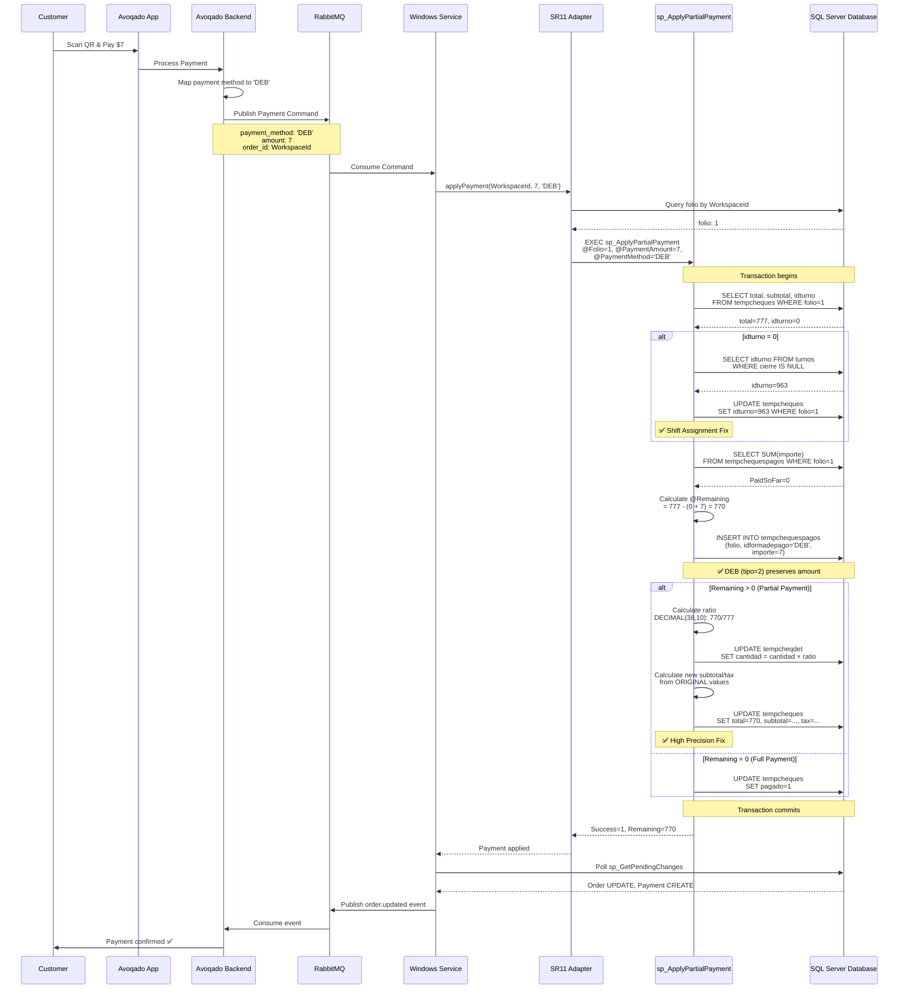
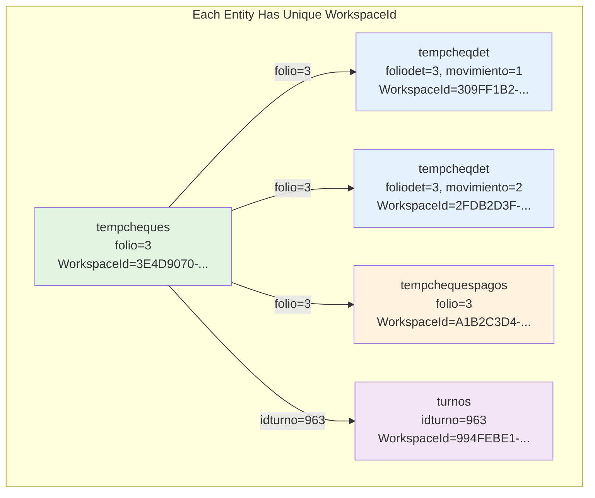
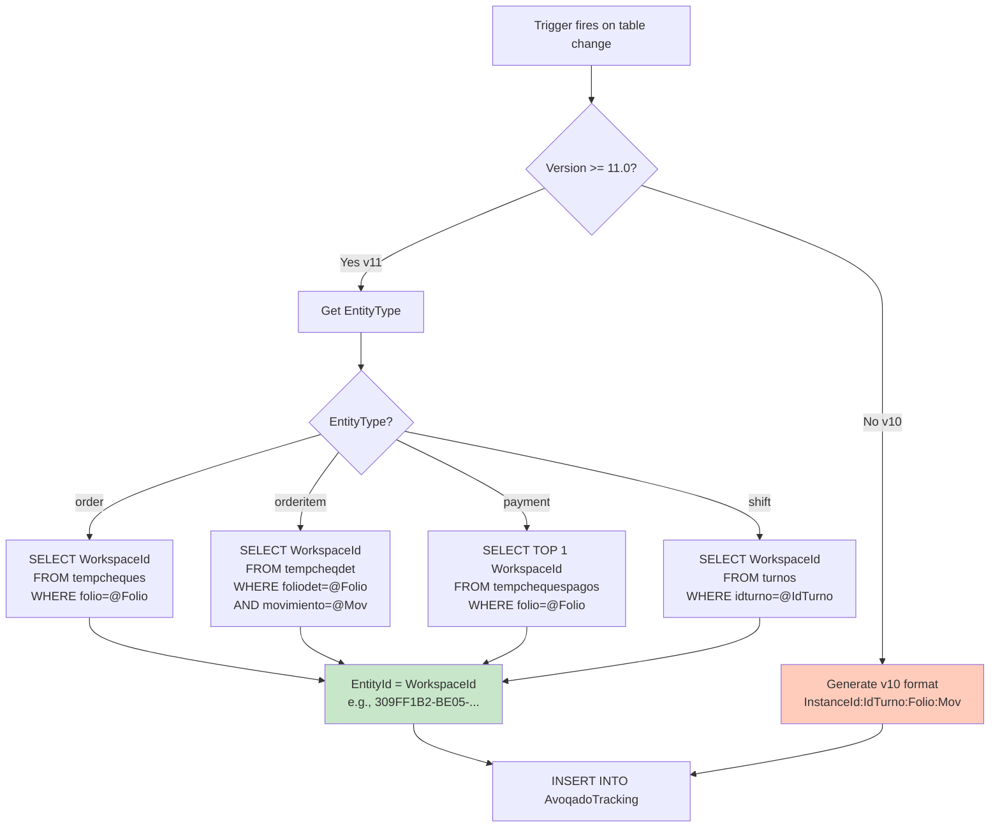
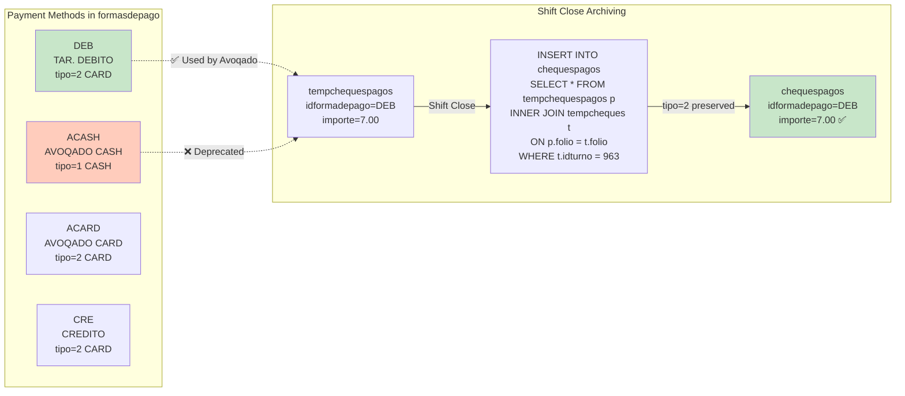
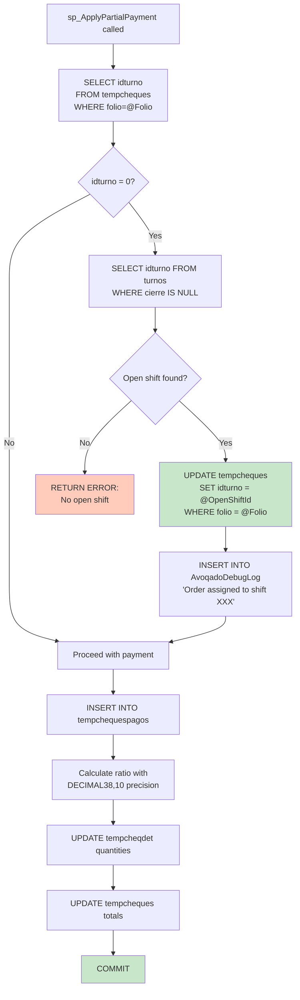
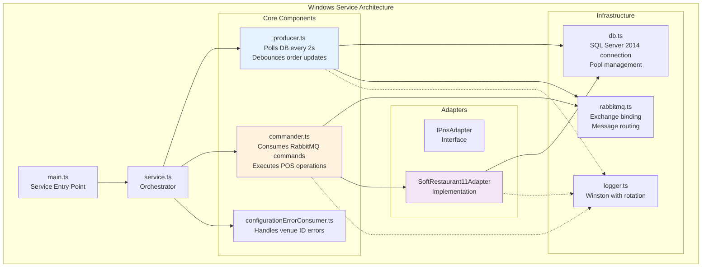
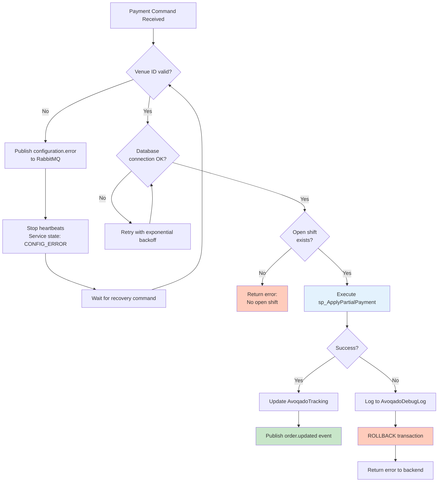

# Avoqado Payment Flow Architecture Diagram

## Complete Payment Flow



## Database Architecture - v11 WorkspaceId Model



## Entity ID Generation (v11)



## Payment Method Types & Archiving



## Shift Assignment Logic



## Precision Calculation (High Precision Fix)

```mermaid
flowchart TD
    Start[Payment Applied: $7 of $777]
    Start --> SaveOriginal[Save ORIGINAL values:<br/>@OriginalSubtotal<br/>@OriginalTax]

    SaveOriginal --> CalcRemaining[@Remaining = Total - PaidSoFar - Payment<br/>= 777 - 0 - 7 = 770]

    CalcRemaining --> CalcRatio[@RemainingRatio<br/>= DECIMAL38,10<br/>770 / 777<br/>= 0.9909909910]

    CalcRatio --> UpdateQty[UPDATE tempcheqdet<br/>cantidad = CAST<br/>cantidad × ratio<br/>AS DECIMAL18,6]

    UpdateQty --> CalcSubtotal[@NewSubtotal<br/>= ROUND<br/>OriginalSubtotal × ratio<br/>2 decimals]

    CalcSubtotal --> CalcTax[@NewTax<br/>= @Remaining - @NewSubtotal<br/>✅ Ensures subtotal + tax = total]

    CalcTax --> UpdateOrder[UPDATE tempcheques<br/>total = 770<br/>subtotal = NewSubtotal<br/>tax = NewTax]

    style CalcRatio fill:#e1f5e1
    style CalcTax fill:#e1f5e1
    style UpdateOrder fill:#c8e6c9
```

## Windows Service Components



## Producer Event Flow (v11 Entity IDs)

```mermaid
sequenceDiagram
    participant DB as SQL Server
    participant Trigger as Database Trigger
    participant Track as AvoqadoTracking
    participant Producer as Producer (polling)
    participant Validate as Entity ID Validator
    participant Process as Event Processor
    participant RMQ as RabbitMQ

    DB->>Trigger: INSERT/UPDATE on tempcheqdet
    Trigger->>Trigger: fn_GetAvoqadoEntityIdWithWorkspace<br/>Query item's WorkspaceId
    Trigger->>Track: INSERT EntityId=309FF1B2-...<br/>EntityType=orderitem

    loop Every 2 seconds
        Producer->>Track: sp_GetPendingChanges<br/>(max 100 results)
        Track-->>Producer: EntityId=309FF1B2-..., Type=orderitem

        Producer->>Validate: Split EntityId by ':'
        Validate->>Validate: parts.length === 1? ✅
        Note over Validate: v11 format validation

        Validate->>Process: processOrderItemChangeV11
        Process->>DB: SELECT * FROM tempcheqdet<br/>WHERE WorkspaceId = '309FF1B2-...'
        DB-->>Process: Item data + parent order WorkspaceId

        Process->>Process: Build payload with<br/>externalId=309FF1B2-...<br/>parentOrderExternalId=3E4D9070-...

        Process->>RMQ: Publish orderitem.created event
        Process->>Track: Mark as processed
    end

    style Validate fill:#c8e6c9
    style Process fill:#e3f2fd
```

## Error Handling & Recovery



## Key Metrics & Monitoring

```mermaid
graph LR
    subgraph "Performance Metrics"
        Polling[Producer Polling<br/>Every 2 seconds<br/>Max 100 records]
        Debounce[Order Debouncing<br/>2.5 second window<br/>Reduces message volume]
        Heartbeat[Heartbeat<br/>Every 60 seconds<br/>Service health check]
    end

    subgraph "Database Operations"
        EntityID[Entity ID Generation<br/>< 1ms overhead<br/>DECIMAL(38,10) precision]
        Payment[Payment Processing<br/>Transaction safe<br/>High precision ratio calc]
        Tracking[Change Tracking<br/>Indexed by Timestamp<br/>Processed flag]
    end

    subgraph "Diagnostics"
        DebugLog[AvoqadoDebugLog<br/>All payment operations<br/>Indexed by Timestamp]
        Verification[00-VERIFICATION.sql<br/>System health check<br/>Trigger status validation]
        Diagnostic[03-DIAGNOSTICS.sql<br/>Performance analysis<br/>Cleanup recommendations]
    end

    Polling -.-> Tracking
    Payment -.-> DebugLog
    EntityID -.-> Tracking

    style EntityID fill:#c8e6c9
    style Payment fill:#c8e6c9
    style DebugLog fill:#e3f2fd
```

---

## How to Use This Diagram

1. **Copy the code blocks above** (each ```mermaid block)
2. **Paste into any Mermaid tool**:
   - Online: https://mermaid.live/
   - VS Code: Mermaid Preview extension
   - Documentation: Markdown files support Mermaid
   - Draw.io: Import as Mermaid

3. **Export options**:
   - PNG/SVG for presentations
   - PDF for documentation
   - Editable format for updates

## Diagram Sections

1. **Complete Payment Flow** - End-to-end sequence from customer to database
2. **Database Architecture** - v11 WorkspaceId model with unique IDs per entity
3. **Entity ID Generation** - SQL function logic for v10/v11 formats
4. **Payment Method Types** - DEB vs deprecated methods and archiving behavior
5. **Shift Assignment Logic** - Automatic idturno=0 → current shift assignment
6. **Precision Calculation** - High precision fix using DECIMAL(38,10)
7. **Windows Service Components** - Architecture and component relationships
8. **Producer Event Flow** - v11 Entity ID validation and processing
9. **Error Handling** - Configuration errors, database failures, recovery
10. **Key Metrics** - Performance characteristics and monitoring tools

---

**Generated**: 2025-10-01
**Version**: v2.5.0
**Status**: Production Ready ✅
